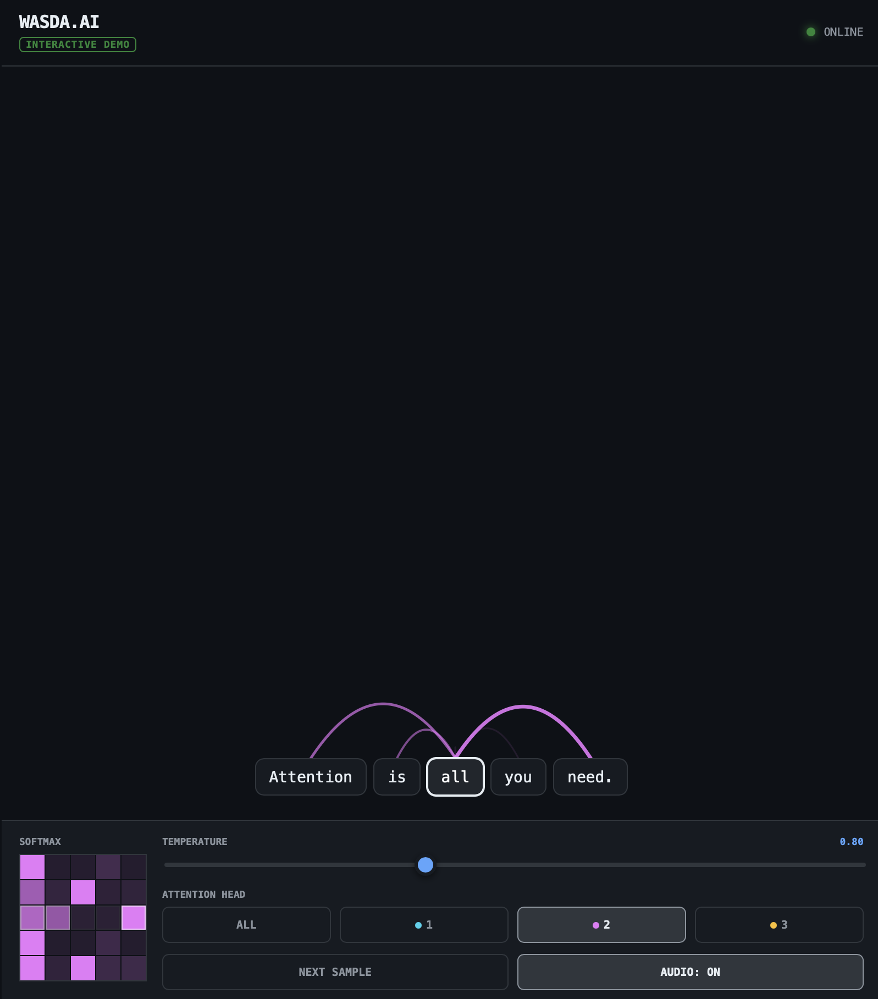

# wasda

The first playable AI instrument—experience transformer attention as music through an interactive visualization where each token becomes a note.

## Live demo
- Interactive site: https://wasda.ai
- Short video tour: [YouTube](https://www.youtube.com/shorts/IwKaDY3sUnw)

## Quick start
This project runs entirely in the browser. To try it locally:
1. Clone or download the repository.
2. Open `index.html` directly in your browser (Google Chrome recommended).
3. Interact with the visualization and explore the generated music.

## Screenshot

## Video (embedded link)

## License
Licensed under the Apache License, Version 2.0. See the [LICENSE](LICENSE) file for details.
